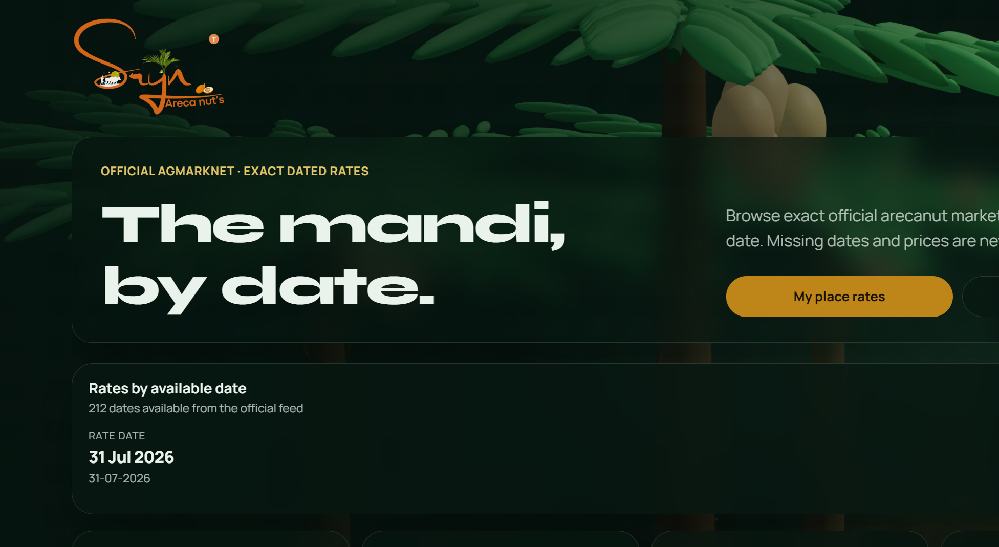
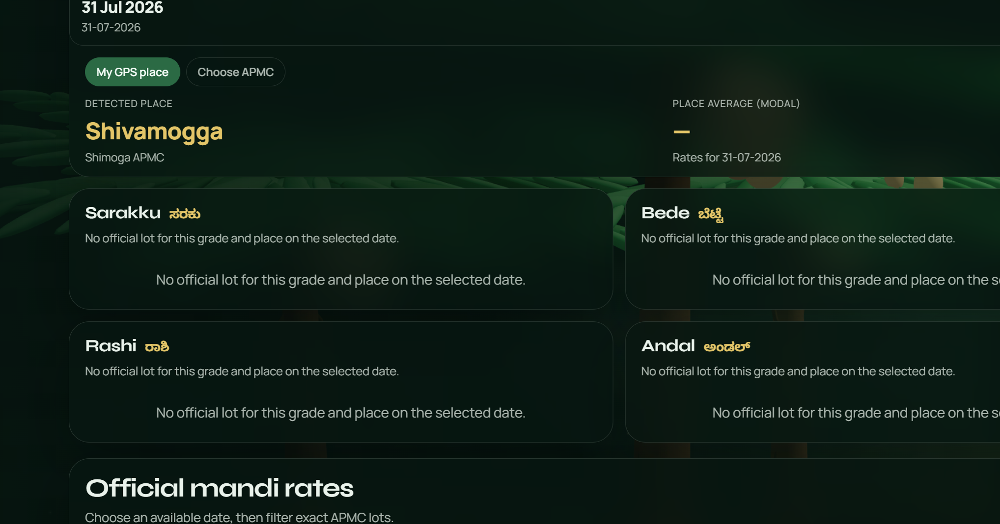
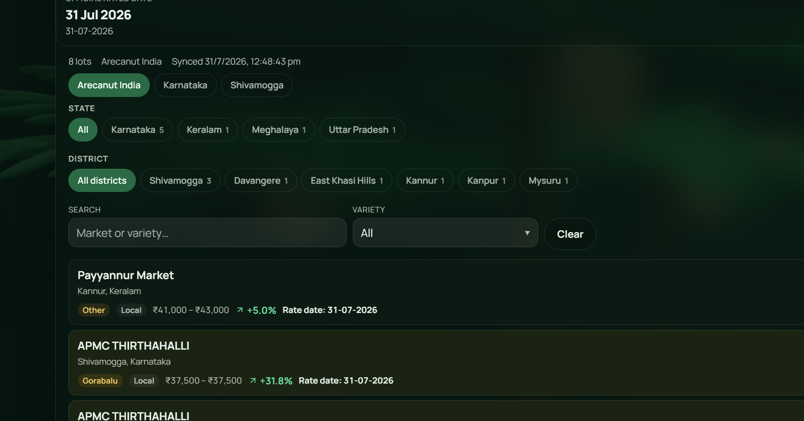
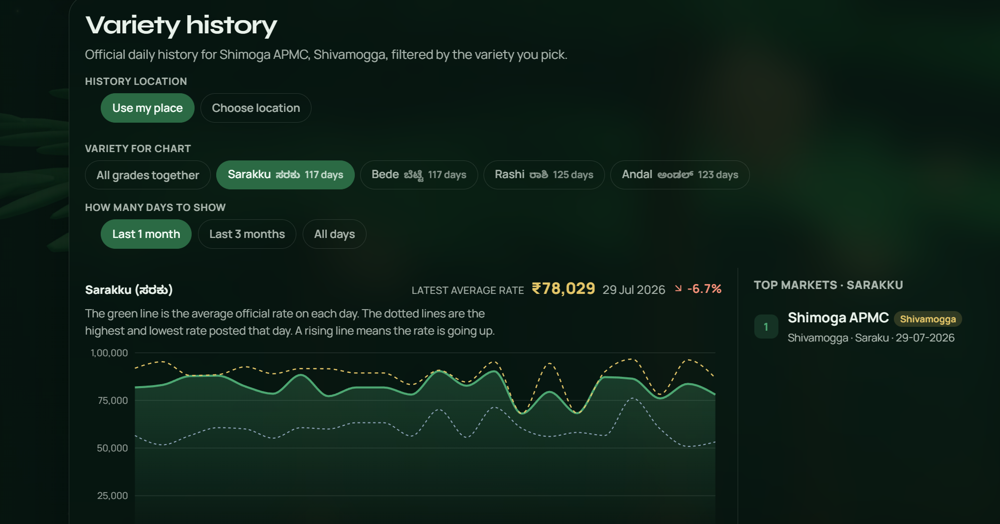

<div align="center">


# Sryn Mandi — Live Arecanut (Adike) Rates

**The official arecanut mandi, browsable by date. Real government rates, never guessed.**

Every price you see comes straight from **AGMARKNET** and **data.gov.in**. If the government
never published a rate for a date, Sryn Mandi shows nothing there — it never invents a number.

[](https://react.dev)
[](https://vitejs.dev)
[](https://www.typescriptlang.org)
[](https://fastapi.tiangolo.com)
[](#-install-on-your-phone)


</div>

<div align="center">
  
</div>

---

## Why this exists

If you grow or trade arecanut, you already know the daily question: **what is the rate today, and where?**
The official numbers are public, but they live behind slow government portals and a captcha, spread across
different markets and dates. **Sryn Mandi puts them in one clean, fast screen** — in your language, with a
price history you can actually read.

> Built by a farmer's son from Shivamogga, for the people who live by these rates.

---

## What you can do

- **See today's rate at a glance** — the top card shows the average, peak and floor for your district.
- **Your place rates** — use GPS or pick your APMC to see the exact official lots for your market.
- **Browse any available date** — a calendar highlights only the dates that have official data.
- **Filter official lots** — by state, district, market, and variety (Sarakku, Bede, Rashi, Andal…).
- **Read the price history** — a clear chart of average / highest / lowest rate per day, plus top markets.
- **Switch language and theme** — English · ಕನ್ನಡ · हिन्दी, and light / dark, right from the header.
- **Install it like an app** — works offline-friendly as a PWA on Android and iPhone home screens.

---

## See it in action

|  Your place rates  |  Official mandi lots  |
| :---: | :---: |
|  |  |
|  **Price history chart**  |  **Full Kannada + light theme**  |
|  |  |

---

## The one promise: never a fake number

This is the rule the whole app is built around:

> **If the government did not publish it, Sryn Mandi does not show it.**

- Missing dates cannot be selected. Missing prices are left blank — never filled in.
- Multi-day history from AGMARKNET is captcha-gated. When AGMARKNET asks, the app shows you the
  **official captcha once**; solving it unlocks the exact dated history, which is then archived so
  you don't have to solve it again.
- Every fetched row is saved to a durable archive, so an upstream outage never empties the board.

---

## Tech stack

| Layer | Technology |
| --- | --- |
| Frontend | React 19 · Vite 8 · TypeScript |
| Charts / 3D | Recharts · three.js (`@react-three/fiber`, `drei`) for the hero scene |
| UI | Custom CSS · `lucide-react` icons · `date-fns` |
| App shell | PWA (`vite-plugin-pwa`, Workbox) — installable + offline-friendly |
| Backend | Python · FastAPI · Uvicorn |
| Data | AGMARKNET report API + data.gov.in daily feed, cached to a JSON archive |
| Deploy | Vercel (web + `api/` serverless) or Vercel + Render for the API |

---

## Getting started (run it locally)

**Prerequisites:** [Node.js 18+](https://nodejs.org) and [Python 3.11+](https://www.python.org/downloads/).

```bash
# 1. Clone the project
git clone https://github.com/Nishanth1409/sryn-mandi.git
cd sryn-mandi

# 2. Install the frontend packages
npm install

# 3. Install the Python API dependencies
npm run setup:api

# 4. Start everything (API + web together)
npm run dev
```

Then open **http://127.0.0.1:5173** in your browser. The API runs on **http://127.0.0.1:8001**.

> First load fetches today's lots live from the open-data feed. Older dates come from the archive,
> or unlock via the AGMARKNET captcha panel when it appears.

### Handy scripts

| Command | What it does |
| --- | --- |
| `npm run dev` | Runs the API and the web app together |
| `npm run dev:web` | Web only (Vite) |
| `npm run dev:api` | API only (FastAPI / Uvicorn) |
| `npm run build` | Type-checks and builds the production web bundle |
| `npm run preview` | Serves the production build locally |
| `npm run lint` | Lints with oxlint |

---

## API reference

| Method | Endpoint | Purpose |
| --- | --- | --- |
| `GET` | `/api/prices` | Official lots for a date, with filters |
| `GET` | `/api/history` | Daily price history for a place + variety |
| `GET` | `/api/health` | Source status, failure counts, archive coverage |
| `GET` | `/api/agmarknet/captcha` | Fetch the official AGMARKNET captcha image |
| `POST` | `/api/agmarknet/unlock` | Submit the captcha answer to unlock dated history |
| `GET` | `/api/agmarknet/status` | Current unlock / archive status |

---

## Project structure

```
arecanut-market/
├─ src/                      # React + TypeScript frontend
│  ├─ components/            # Calendar, market panels, history chart, install banner…
│  ├─ i18n/                  # EN / ಕನ್ನಡ / हिन्दी messages + preferences
│  ├─ geo/                   # APMC / mandi location data
│  └─ api.ts                 # Typed API client
├─ backend/                  # FastAPI service
│  ├─ main.py                # Routes + fetch/self-heal orchestration
│  ├─ agmarknet_access.py    # AGMARKNET captcha + report paging
│  ├─ archive.py             # Durable JSON archive
│  └─ data/                  # market_archive.json (grows as data unlocks)
├─ api/                      # Vercel serverless entry for the API
├─ public/                   # Icons, logos, PWA assets
└─ scripts/                  # Utilities (e.g. theme logo generator)
```

---

## Deployment

The project ships with configs for two setups:

- **All-in-one on Vercel** — `vercel.json` serves the web build and runs the API from `api/`.
- **Web on Vercel + API on Render** — use `render.yaml` / `Dockerfile` for the API, then set
  `VITE_API_URL=https://YOUR-API.onrender.com` on the web project.

---

## Data & credits

- Rates: **AGMARKNET** (Directorate of Marketing & Inspection) and **data.gov.in**.
- Prices are shown in **₹ per quintal (100 kg)**, exactly as published.
- This is an independent tool and is not affiliated with any government body.

---

<div align="center">

Made with care by **Nishanth K R** — *son of a farmer, always a farmer.*

[Portfolio](https://nkrportfolio.vercel.app) · [GitHub](https://github.com/Nishanth1409)

</div>
